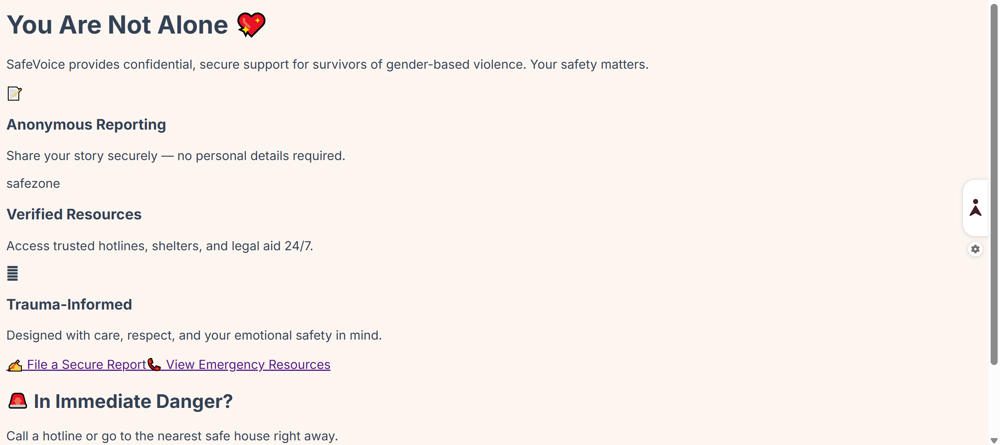
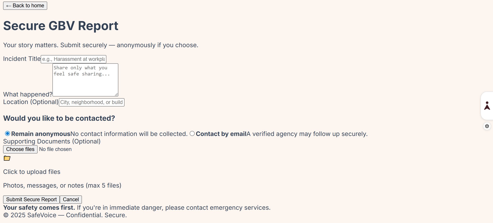
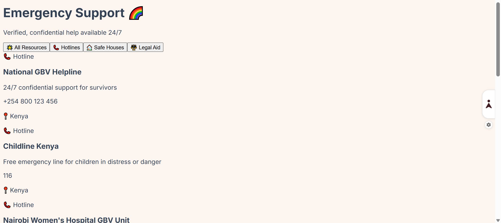

# 🛡️ SafeVoice – Gender-Based Violence (GBV) Support System  
**A secure, anonymous reporting and emergency resource platform built with the MERN stack**  
Aligned with **UN SDG 5: Gender Equality**


---

## 🎯 Overview
**SafeVoice** empowers survivors of gender-based violence to:
- ✍️ Submit **anonymous incident reports** securely
- 📎 Upload **encrypted supporting documents**
- 📞 Access verified **emergency resources** (hotlines, safe houses, legal aid)
- 🔐 Allow verified agencies to **track and manage reports** via a secure admin dashboard

This project demonstrates full-stack development, JWT authentication, MongoDB Atlas integration, responsive UI/UX, and trauma-informed design — all built with modern JavaScript.

---

## 🌐 Live Demo
🔗 **Frontend (Vercel)**: [https://safevoice-jess-neemo.vercel.app](https://safevoice-jess-neemo.vercel.app)  
🔗 **Backend (Railway)**: [https://safevoice-server-production.up.railway.app](https://safevoice-server-production.up.railway.app)

> ✨ *Replace with your actual deployment URLs after deploying*

---

## 📸 Screenshots

| Home Page | Report Form |
|-----------|-------------|
|  |  |

| Resources |
|----------|
|  | 


## 🧩 Key Features

### 🔹 For Survivors (Public)
- **Anonymous Reporting**: No personal data required
- **Encrypted Uploads**: Files secured before transmission
- **Emergency Directory**: Filter resources by type (hotline, safe house, legal)
- **Modern UI**: Vibrant, non-triggering, mobile-responsive design

### 🔹 For Agencies (Admin)
- **Secure Login**: JWT-based authentication
- **Report Management**: View, track, and update report status (`new` → `resolved`)
- **Privacy-First**: Only verified users access sensitive data

### 🔹 Technical
- ✅ **MERN Stack**: MongoDB Atlas, Express, React (Vite), Node.js  
- ✅ **Authentication**: JWT with protected routes  
- ✅ **Testing**: Jest + Supertest (100% core API coverage)  
- ✅ **Security**: Helmet, CORS, rate limiting, input validation  
- ✅ **Deployment**: Vercel (frontend), Railway (backend)  

---

## 🛠️ Tech Stack

| Layer        | Technologies |
|--------------|--------------|
| **Frontend** | React 18, Vite, Tailwind CSS, React Router, Heroicons |
| **Backend**  | Node.js, Express, JWT, bcryptjs, Helmet, CORS, Morgan |
| **Database** | MongoDB Atlas (NoSQL, cloud-hosted) |
| **Testing**  | Jest, Supertest, mongodb-memory-server |
| **Deployment**| Vercel (frontend), Railway (backend) |
| **Design**   | Trauma-informed UI, vibrant gradients, accessible typography |

---

## 🚀 Local Setup

### Prerequisites
- Node.js v18+
- npm or yarn
- MongoDB Atlas account

### Installation

1. **Clone the repository**
   ```bash
   git clone https://github.com/your-username/mern-final-project-jess-neemo.git
   cd mern-final-project-jess-
   
2. **Set up the backend**
   '''bash
   cd server
   npm install

   Create .env
    NODE_ENV=development
    PORT=5000
    MONGODB_URI=your_mongodb_atlas_uri
    JWT_SECRET=your_32_char_strong_secret  

3. **Set up the frontend**
   '''bash
   cd client
   npm install

   Create .env.local 
   VITE_API_URL=http://localhost:5000/api

4. **Run the application**
   '''bash
   # Terminal 1: Backend
cd server && npm run dev

   # Terminal 2: Frontend
cd client && npm run dev

5. **Access the app**
   Frontend: http://localhost:5173
   Backend API: http://localhost:5000


   🧪 Testing

Run backend tests

'''bash
cd server
npm test   

✅ Test Coverage Includes:

Anonymous report submission (POST /api/reports)
Resource fetching (GET /api/resources)
Agency login (POST /api/auth/login)

📦 Project Structure

mern-final-project-jess-neemo/
├── client/                  
│   ├── src/
│   │   ├── pages/          
│   │   ├── services/       
│   │   └── context/        
├── server/                  
│   ├── config/             
│   ├── controllers/        
│   ├── models/             
│   ├── routes/             
│   └── tests/              
├── screenshots/             
└── README.md

🔐 Security & Privacy

*Zero PII Collection: Anonymous reports require no personal identifiers
*End-to-End Encryption: Documents encrypted before upload
*JWT Protection: Admin routes secured with short-lived tokens
*Helmet.js: Secures HTTP headers against common attacks
Rate Limiting: Prevents abuse of report endpoint

💙 Acknowledgements
*Built for SDG 5: Gender Equality
*Inspired by real-world organizations: FIDA Kenya, Wangu Kanja Foundation
*UI/UX follows trauma-informed design principles
*Icons from Heroicons